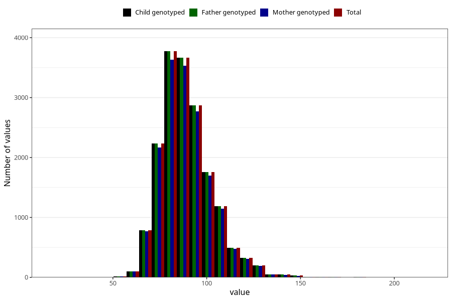

# weight_hf
Variable mapping to `HF128` in `HelseFedre`.
- Number of values:

| Value | Total | Child genotyped | Mother genotyped | Father genotyped |
| ----- | ----- | --------------- | ---------------- | ---------------- |
| Missing | 63451 | 63451 | 59277 | 35739 |
| Non-missing | 17572 | 17572 | 16952 | 17572 |
| 25th percentile | 80 | 80 | 80 | 80 |
| 50th percentile | 88 | 88 | 88 | 88 |
| 75th percentile | 97 | 97 | 97 | 97 |
| Mean | 89.4388231277032 | 89.4388231277032 | 89.4096271826333 | 89.4388231277032 |
| Standard deviation | 13.9497403390475 | 13.9497403390475 | 13.9007105335904 | 13.9497403390475 |
| N | 17572 | 17572 | 16952 | 17572 |

