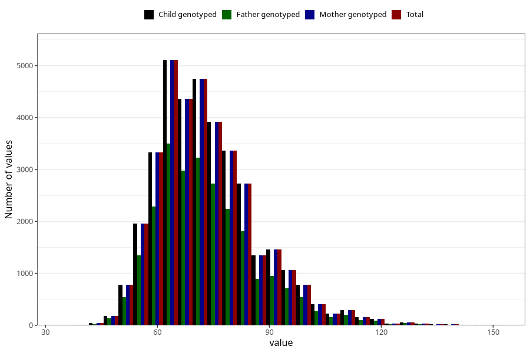

# weight_hm
Variable mapping to `HM260` in `HelseModre`.
- Number of values:

| Value | Total | Child genotyped | Mother genotyped | Father genotyped |
| ----- | ----- | --------------- | ---------------- | ---------------- |
| Missing | 44447 | 44447 | 39653 | 28433 |
| Non-missing | 36576 | 36576 | 36576 | 24878 |
| 25th percentile | 64 | 64 | 64 | 64 |
| 50th percentile | 71 | 71 | 71 | 71 |
| 75th percentile | 80 | 80 | 80 | 80 |
| Mean | 73.5945155293088 | 73.5945155293088 | 73.5945155293088 | 73.4768872095828 |
| Standard deviation | 13.6879841232837 | 13.6879841232837 | 13.6879841232837 | 13.6720355919438 |
| N | 36576 | 36576 | 36576 | 24878 |

