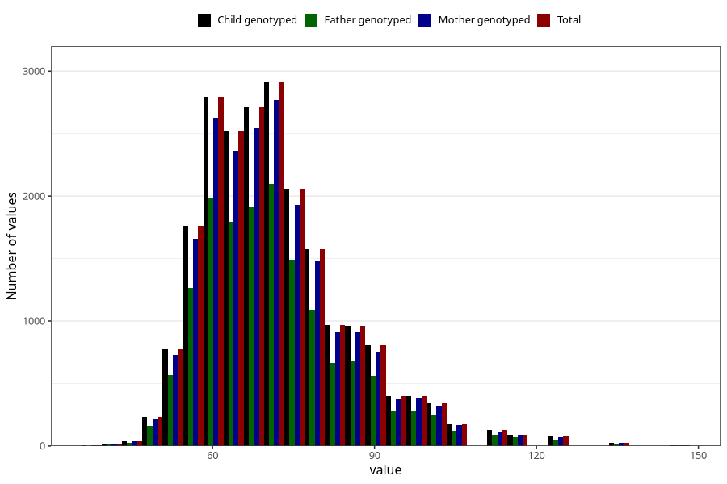

# weight_mother_14m
Variable mapping to `UM272` in `Ungdomsskjema_Mor_v12_standard`.
- Number of values:

| Value | Total | Child genotyped | Mother genotyped | Father genotyped |
| ----- | ----- | --------------- | ---------------- | ---------------- |
| Missing | 59252 | 59252 | 55729 | 37848 |
| Non-missing | 21771 | 21771 | 20500 | 15463 |
| 25th percentile | 62 | 62 | 62 | 62 |
| 50th percentile | 70 | 70 | 70 | 70 |
| 75th percentile | 79 | 79 | 79 | 78 |
| Mean | 71.666942262643 | 71.666942262643 | 71.6481951219512 | 71.605897949945 |
| Standard deviation | 13.2626552669072 | 13.2626552669072 | 13.2377288242208 | 13.2486892772868 |
| N | 21771 | 21771 | 20500 | 15463 |

