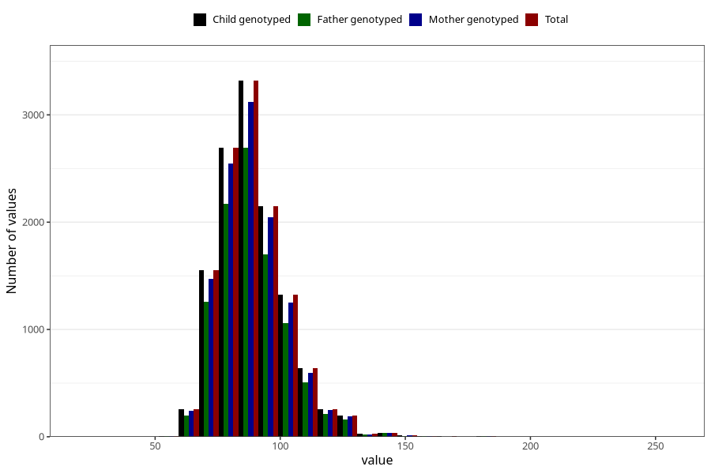

# weight_now_45f
Variable mapping to `LF34` in `MobaForeldre45_Far_v12_standard`.
- Number of values:

| Value | Total | Child genotyped | Mother genotyped | Father genotyped |
| ----- | ----- | --------------- | ---------------- | ---------------- |
| Missing | 68515 | 68515 | 64416 | 43253 |
| Non-missing | 12508 | 12508 | 11813 | 10058 |
| 25th percentile | 80 | 80 | 80 | 80 |
| 50th percentile | 87 | 87 | 87.7 | 87 |
| 75th percentile | 96 | 96 | 96 | 96 |
| Mean | 89.3216101694915 | 89.3216101694915 | 89.2944298654025 | 89.3193577251939 |
| Standard deviation | 13.9668244163983 | 13.9668244163983 | 13.8496798894924 | 13.9733876849441 |
| N | 12508 | 12508 | 11813 | 10058 |

