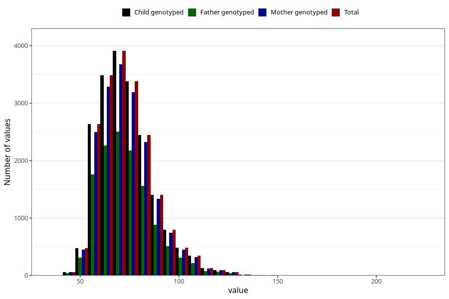

# weight_now_45m
Variable mapping to `LM29` in `MobaForeldre45_Mor_v12_standard`.
- Number of values:

| Value | Total | Child genotyped | Mother genotyped | Father genotyped |
| ----- | ----- | --------------- | ---------------- | ---------------- |
| Missing | 61262 | 61262 | 57587 | 40556 |
| Non-missing | 19761 | 19761 | 18642 | 12755 |
| 25th percentile | 64 | 64 | 64 | 64 |
| 50th percentile | 71 | 71 | 71 | 71 |
| 75th percentile | 80 | 80 | 80 | 80 |
| Mean | 73.7489347705076 | 73.7489347705076 | 73.7242409612703 | 73.6077459819679 |
| Standard deviation | 14.071553194855 | 14.071553194855 | 14.0150898382481 | 14.1025977905594 |
| N | 19761 | 19761 | 18642 | 12755 |

