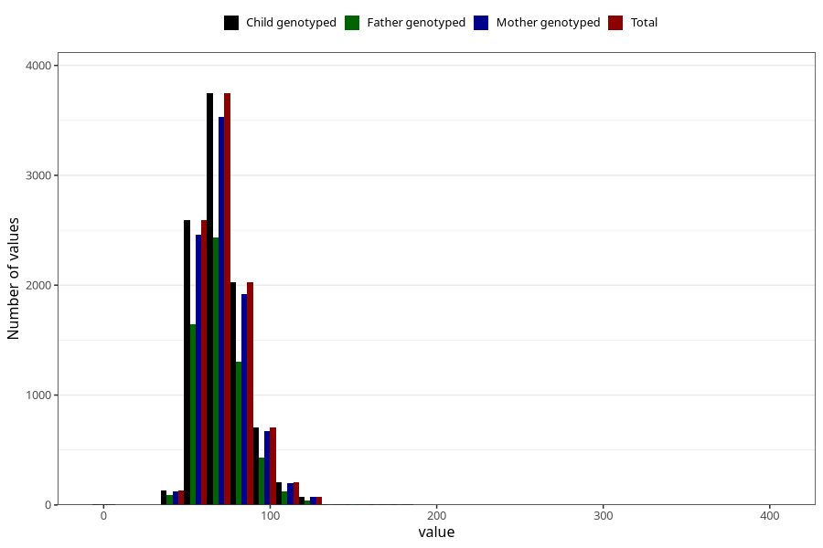

# weight_ung
Variable mapping to `UH52` in `UngHelse_standard`.
- Number of values:

| Value | Total | Child genotyped | Mother genotyped | Father genotyped |
| ----- | ----- | --------------- | ---------------- | ---------------- |
| Missing | 71489 | 71489 | 67204 | 47214 |
| Non-missing | 9534 | 9534 | 9025 | 6097 |
| 25th percentile | 61 | 61 | 61 | 61 |
| 50th percentile | 70 | 70 | 70 | 70 |
| 75th percentile | 80 | 80 | 80 | 80 |
| Mean | 71.5324103209566 | 71.5324103209566 | 71.5574515235457 | 71.3165491225193 |
| Standard deviation | 15.454394099755 | 15.454394099755 | 15.4454702462781 | 14.9141850832828 |
| N | 9534 | 9534 | 9025 | 6097 |

