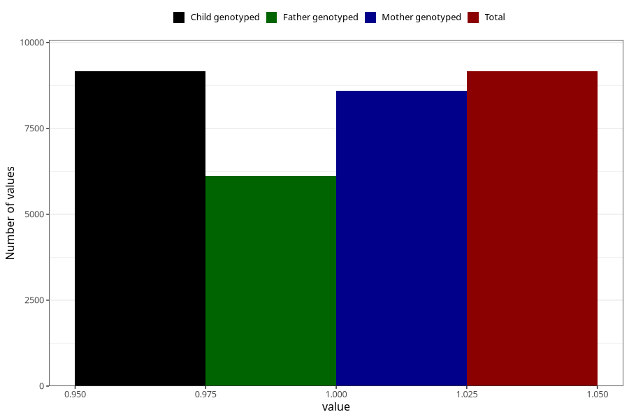

# back_pain_9w_12w
Variable mapping to `AA198` in `Skjema1_v12`.
- Number of values:

| Value | Total | Child genotyped | Mother genotyped | Father genotyped |
| ----- | ----- | --------------- | ---------------- | ---------------- |
| Missing | 71865 | 71865 | 67632 | 47192 |
| Non-missing | 9158 | 9158 | 8597 | 6119 |
| 1 | 9158 | 9158 | 8597 | 6119 |

