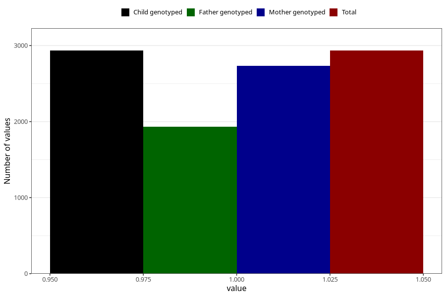

# back_pain_before_4w
Variable mapping to `AA196` in `Skjema1_v12`.
- Number of values:

| Value | Total | Child genotyped | Mother genotyped | Father genotyped |
| ----- | ----- | --------------- | ---------------- | ---------------- |
| Missing | 78089 | 78089 | 73495 | 51379 |
| Non-missing | 2934 | 2934 | 2734 | 1932 |
| 1 | 2934 | 2934 | 2734 | 1932 |

