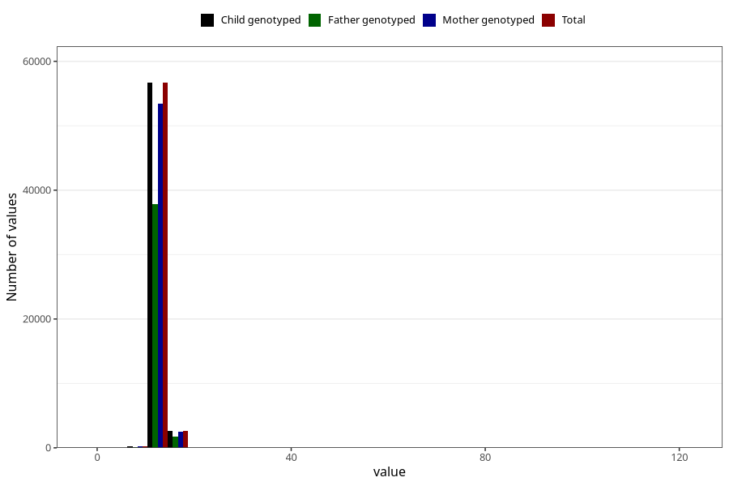

# blood_haemoglobin_highest_30w
Variable mapping to `CC126` in `Skjema3_v12`.
- Number of values:

| Value | Total | Child genotyped | Mother genotyped | Father genotyped |
| ----- | ----- | --------------- | ---------------- | ---------------- |
| Missing | 21393 | 21393 | 19951 | 13470 |
| Non-missing | 59630 | 59630 | 56278 | 39841 |
| 25th percentile | 12.3 | 12.3 | 12.3 | 12.3 |
| 50th percentile | 12.9 | 12.9 | 12.9 | 12.9 |
| 75th percentile | 13.5 | 13.5 | 13.5 | 13.5 |
| Mean | 13.0039091061546 | 13.0039091061546 | 13.0015761043392 | 13.0055269697046 |
| Standard deviation | 2.37572433627658 | 2.37572433627658 | 2.34064966061242 | 2.2288844243568 |
| N | 59630 | 59630 | 56278 | 39841 |

