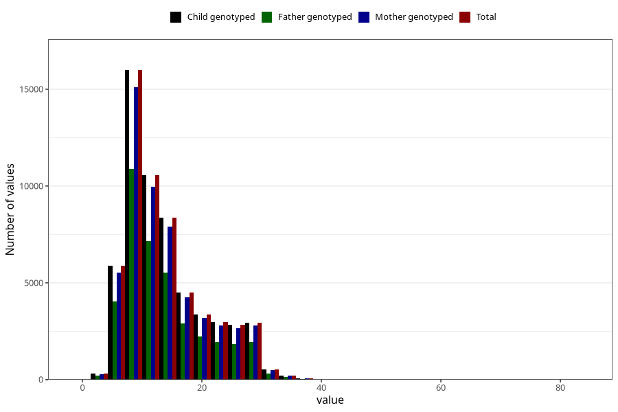

# blood_haemoglobin_highest_week_30w
Variable mapping to `CC127` in `Skjema3_v12`.
- Number of values:

| Value | Total | Child genotyped | Mother genotyped | Father genotyped |
| ----- | ----- | --------------- | ---------------- | ---------------- |
| Missing | 22498 | 22498 | 20980 | 14168 |
| Non-missing | 58525 | 58525 | 55249 | 39143 |
| 25th percentile | 9 | 9 | 9 | 9 |
| 50th percentile | 12 | 12 | 12 | 12 |
| 75th percentile | 17 | 17 | 17 | 17 |
| Mean | 13.9625800939769 | 13.9625800939769 | 13.959673478253 | 13.8344787062821 |
| Standard deviation | 6.65750949560918 | 6.65750949560918 | 6.65430927253461 | 6.60030011940289 |
| N | 58525 | 58525 | 55249 | 39143 |

