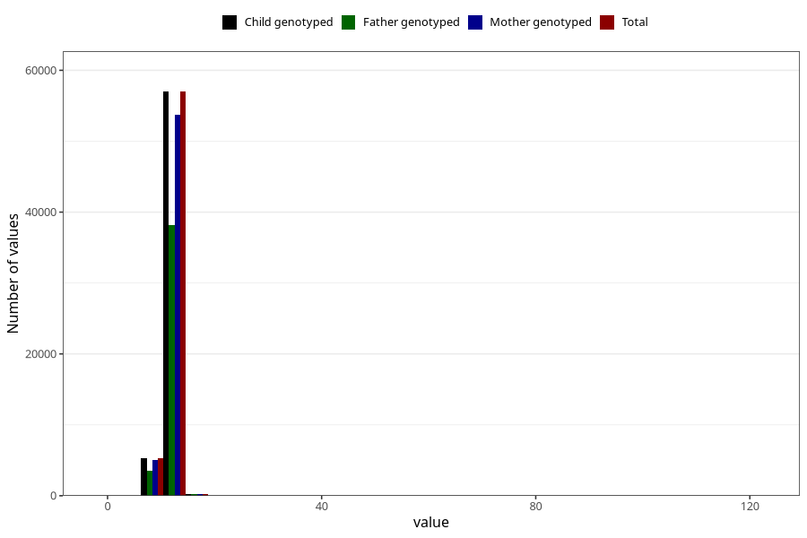

# blood_haemoglobin_last_check_30w
Variable mapping to `CC124` in `Skjema3_v12`.
- Number of values:

| Value | Total | Child genotyped | Mother genotyped | Father genotyped |
| ----- | ----- | --------------- | ---------------- | ---------------- |
| Missing | 18277 | 18277 | 17072 | 11351 |
| Non-missing | 62746 | 62746 | 59157 | 41960 |
| 25th percentile | 11.2 | 11.2 | 11.2 | 11.2 |
| 50th percentile | 11.8 | 11.8 | 11.8 | 11.9 |
| 75th percentile | 12.5 | 12.5 | 12.5 | 12.5 |
| Mean | 11.9312003952443 | 11.9312003952443 | 11.9312473587234 | 11.932785986654 |
| Standard deviation | 2.60613131971391 | 2.60613131971391 | 2.63258495991894 | 2.3733162660847 |
| N | 62746 | 62746 | 59157 | 41960 |

