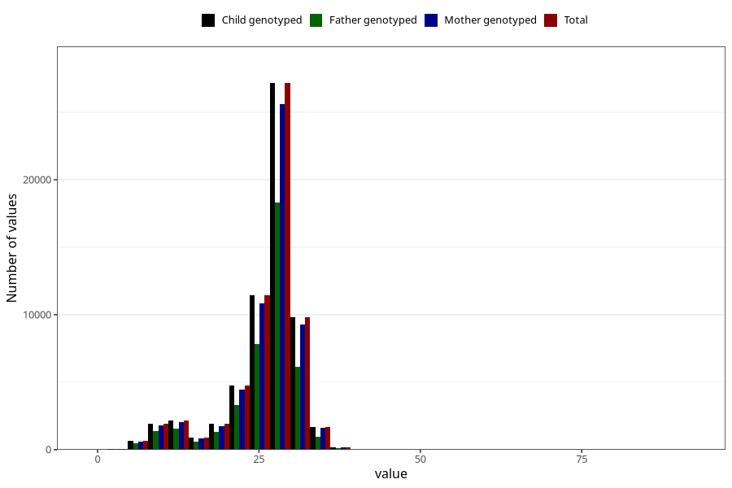

# blood_haemoglobin_last_check_week_30w
Variable mapping to `CC125` in `Skjema3_v12`.
- Number of values:

| Value | Total | Child genotyped | Mother genotyped | Father genotyped |
| ----- | ----- | --------------- | ---------------- | ---------------- |
| Missing | 18350 | 18350 | 17144 | 11368 |
| Non-missing | 62673 | 62673 | 59085 | 41943 |
| 25th percentile | 25 | 25 | 25 | 24 |
| 50th percentile | 28 | 28 | 28 | 27 |
| 75th percentile | 29 | 29 | 29 | 29 |
| Mean | 25.8673112823704 | 25.8673112823704 | 25.8757383430651 | 25.6900317097013 |
| Standard deviation | 5.63688899108658 | 5.63688899108658 | 5.62796145635951 | 5.69602805831148 |
| N | 62673 | 62673 | 59085 | 41943 |

