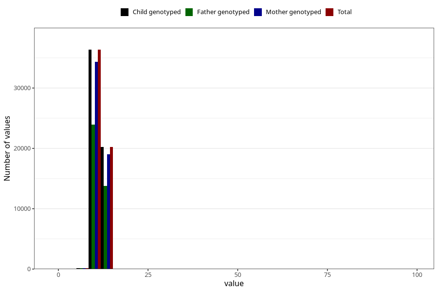

# blood_haemoglobin_lowest_30w
Variable mapping to `CC128` in `Skjema3_v12`.
- Number of values:

| Value | Total | Child genotyped | Mother genotyped | Father genotyped |
| ----- | ----- | --------------- | ---------------- | ---------------- |
| Missing | 24188 | 24188 | 22573 | 15408 |
| Non-missing | 56835 | 56835 | 53656 | 37903 |
| 25th percentile | 10.8 | 10.8 | 10.8 | 10.9 |
| 50th percentile | 11.5 | 11.5 | 11.5 | 11.5 |
| 75th percentile | 12.1 | 12.1 | 12.1 | 12.2 |
| Mean | 11.5375648807953 | 11.5375648807953 | 11.5364469956762 | 11.5436983879904 |
| Standard deviation | 2.19081135980493 | 2.19081135980493 | 2.19711701144146 | 1.92109900877295 |
| N | 56835 | 56835 | 53656 | 37903 |

