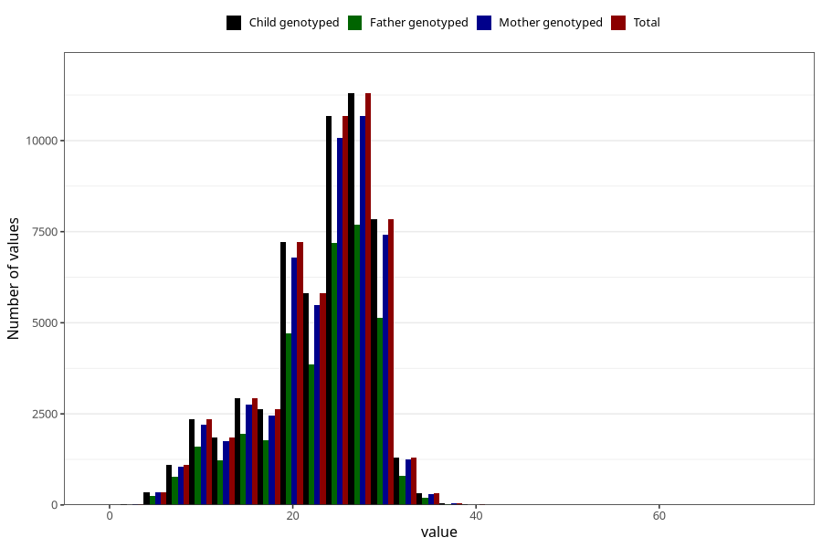

# blood_haemoglobin_lowest_week_30w
Variable mapping to `CC129` in `Skjema3_v12`.
- Number of values:

| Value | Total | Child genotyped | Mother genotyped | Father genotyped |
| ----- | ----- | --------------- | ---------------- | ---------------- |
| Missing | 25262 | 25262 | 23584 | 16114 |
| Non-missing | 55761 | 55761 | 52645 | 37197 |
| 25th percentile | 20 | 20 | 20 | 20 |
| 50th percentile | 24 | 24 | 24 | 24 |
| 75th percentile | 28 | 28 | 28 | 28 |
| Mean | 23.135040619788 | 23.135040619788 | 23.1384936841106 | 23.0905718203081 |
| Standard deviation | 6.17503121253997 | 6.17503121253997 | 6.1781501759903 | 6.18381259559828 |
| N | 55761 | 55761 | 52645 | 37197 |

