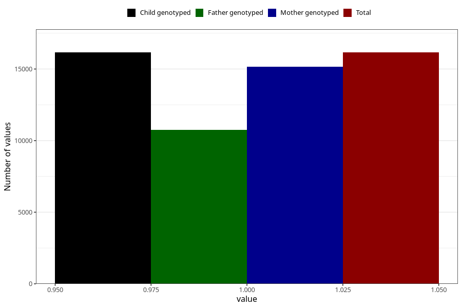

# constipation_13w_15w
Variable mapping to `AA269` in `Skjema1_v12`.
- Number of values:

| Value | Total | Child genotyped | Mother genotyped | Father genotyped |
| ----- | ----- | --------------- | ---------------- | ---------------- |
| Missing | 64866 | 64866 | 61083 | 42568 |
| Non-missing | 16157 | 16157 | 15146 | 10743 |
| 1 | 16157 | 16157 | 15146 | 10743 |

