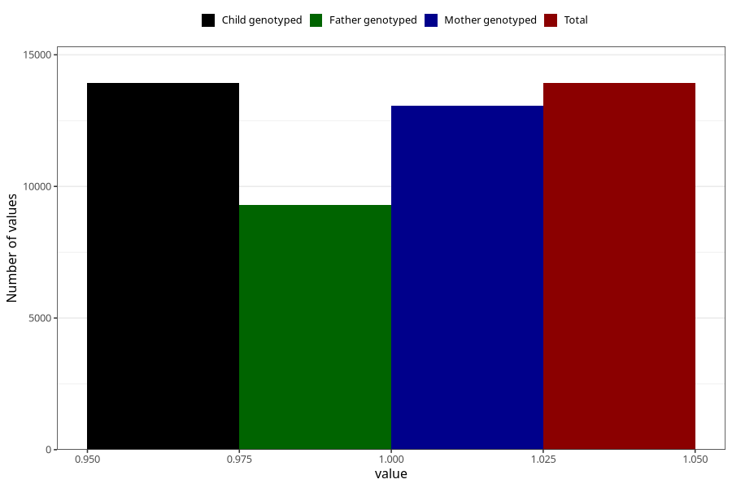

# constipation_5w_8w
Variable mapping to `AA267` in `Skjema1_v12`.
- Number of values:

| Value | Total | Child genotyped | Mother genotyped | Father genotyped |
| ----- | ----- | --------------- | ---------------- | ---------------- |
| Missing | 67099 | 67099 | 63174 | 44020 |
| Non-missing | 13924 | 13924 | 13055 | 9291 |
| 1 | 13924 | 13924 | 13055 | 9291 |

