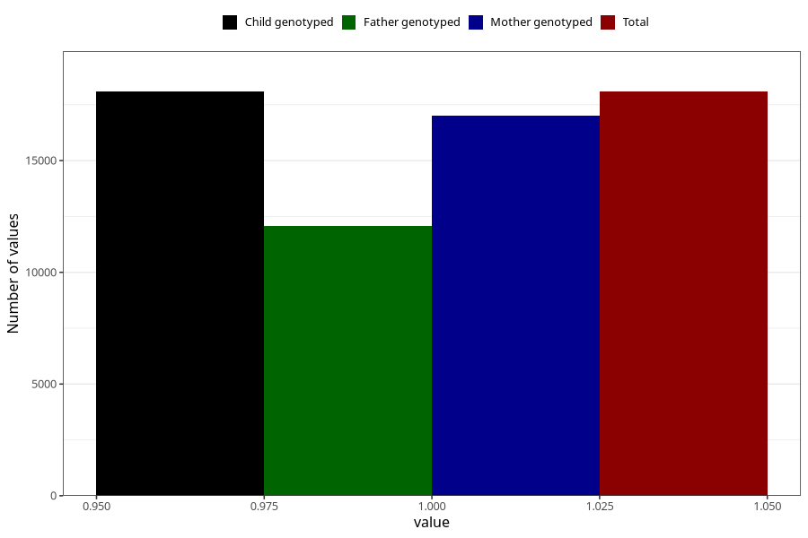

# constipation_9w_12w
Variable mapping to `AA268` in `Skjema1_v12`.
- Number of values:

| Value | Total | Child genotyped | Mother genotyped | Father genotyped |
| ----- | ----- | --------------- | ---------------- | ---------------- |
| Missing | 62937 | 62937 | 59238 | 41253 |
| Non-missing | 18086 | 18086 | 16991 | 12058 |
| 1 | 18086 | 18086 | 16991 | 12058 |

