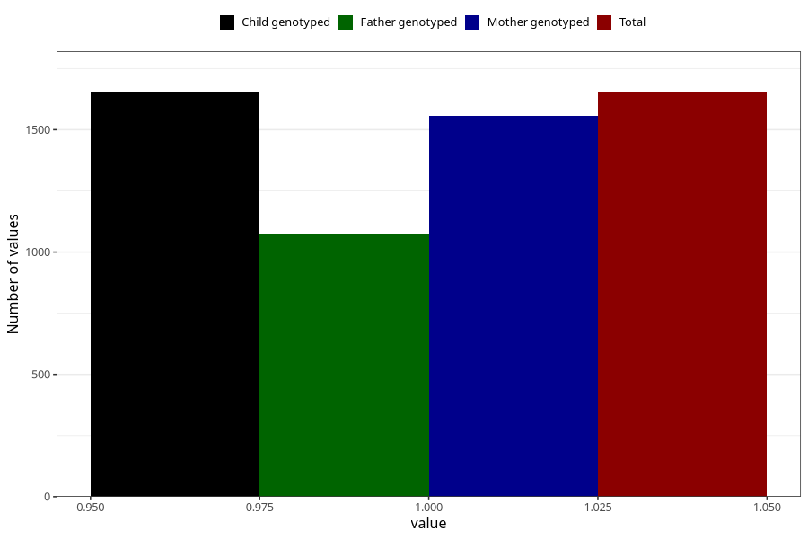

# diarrhoea_13w_16w
Variable mapping to `CC448` in `Skjema3_v12`.
- Number of values:

| Value | Total | Child genotyped | Mother genotyped | Father genotyped |
| ----- | ----- | --------------- | ---------------- | ---------------- |
| Missing | 79368 | 79368 | 74673 | 52235 |
| Non-missing | 1655 | 1655 | 1556 | 1076 |
| 1 | 1655 | 1655 | 1556 | 1076 |

