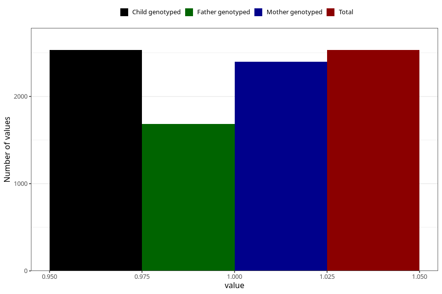

# diarrhoea_5w_8w
Variable mapping to `AA277` in `Skjema1_v12`.
- Number of values:

| Value | Total | Child genotyped | Mother genotyped | Father genotyped |
| ----- | ----- | --------------- | ---------------- | ---------------- |
| Missing | 78492 | 78492 | 73829 | 51628 |
| Non-missing | 2531 | 2531 | 2400 | 1683 |
| 1 | 2531 | 2531 | 2400 | 1683 |

