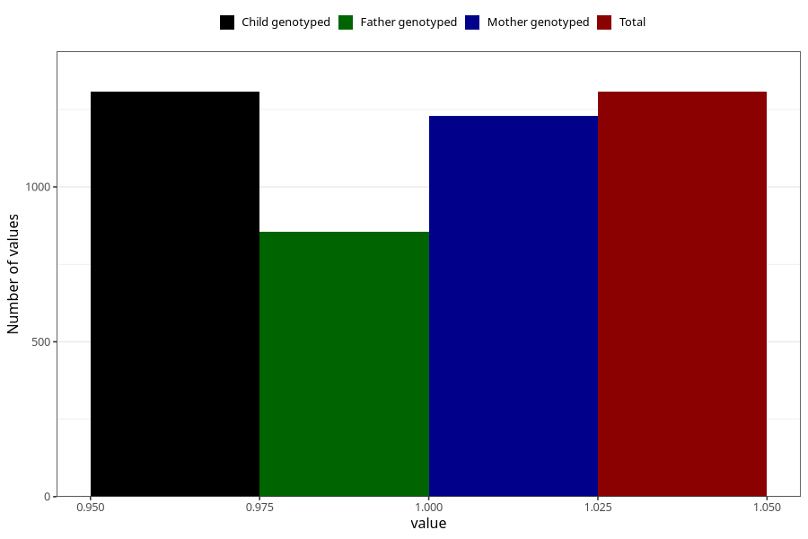

# diarrhoea_before_4w
Variable mapping to `AA276` in `Skjema1_v12`.
- Number of values:

| Value | Total | Child genotyped | Mother genotyped | Father genotyped |
| ----- | ----- | --------------- | ---------------- | ---------------- |
| Missing | 79716 | 79716 | 75000 | 52456 |
| Non-missing | 1307 | 1307 | 1229 | 855 |
| 1 | 1307 | 1307 | 1229 | 855 |

