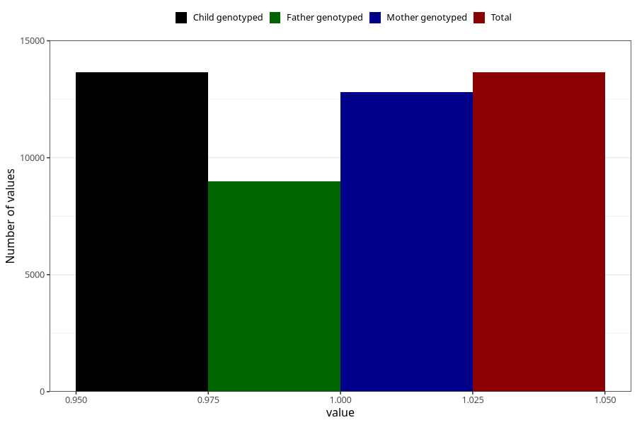

# heartburn_13w_15w
Variable mapping to `AA309` in `Skjema1_v12`.
- Number of values:

| Value | Total | Child genotyped | Mother genotyped | Father genotyped |
| ----- | ----- | --------------- | ---------------- | ---------------- |
| Missing | 67375 | 67375 | 63419 | 44335 |
| Non-missing | 13648 | 13648 | 12810 | 8976 |
| 1 | 13648 | 13648 | 12810 | 8976 |

