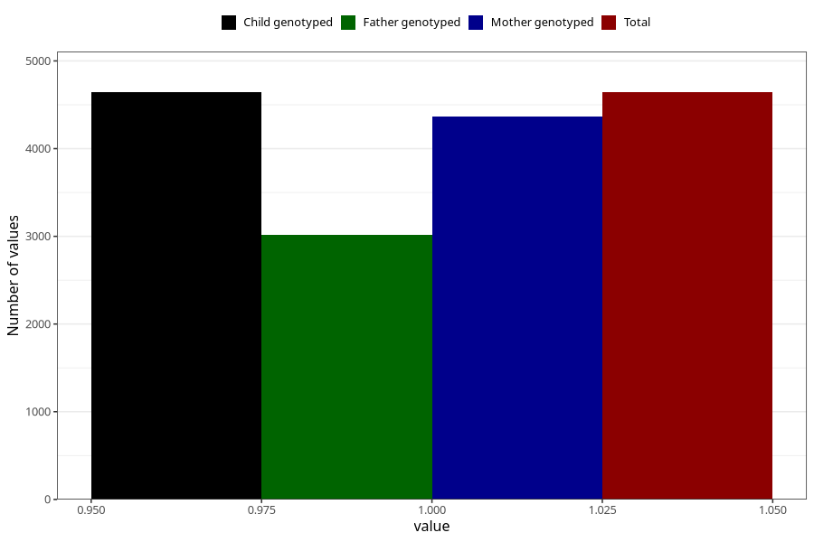

# heartburn_5w_8w
Variable mapping to `AA307` in `Skjema1_v12`.
- Number of values:

| Value | Total | Child genotyped | Mother genotyped | Father genotyped |
| ----- | ----- | --------------- | ---------------- | ---------------- |
| Missing | 76381 | 76381 | 71865 | 50292 |
| Non-missing | 4642 | 4642 | 4364 | 3019 |
| 1 | 4642 | 4642 | 4364 | 3019 |

