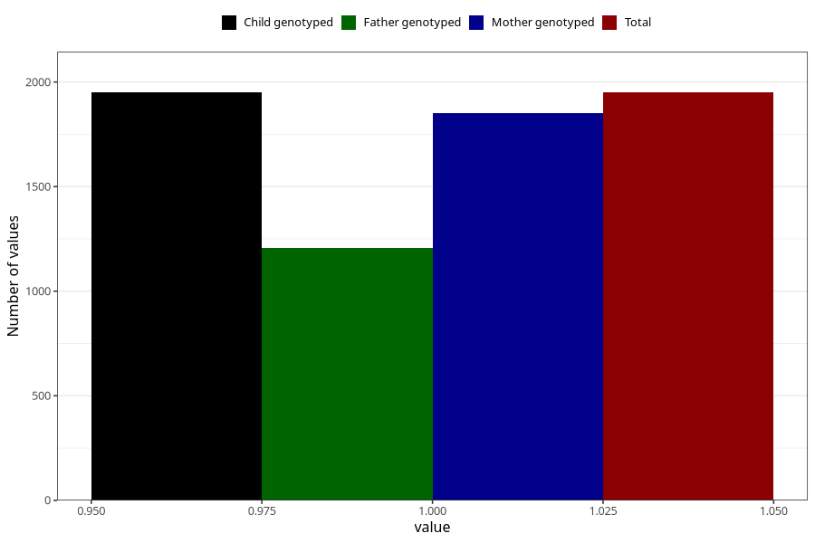

# heartburn_before_4w
Variable mapping to `AA306` in `Skjema1_v12`.
- Number of values:

| Value | Total | Child genotyped | Mother genotyped | Father genotyped |
| ----- | ----- | --------------- | ---------------- | ---------------- |
| Missing | 79073 | 79073 | 74379 | 52105 |
| Non-missing | 1950 | 1950 | 1850 | 1206 |
| 1 | 1950 | 1950 | 1850 | 1206 |

