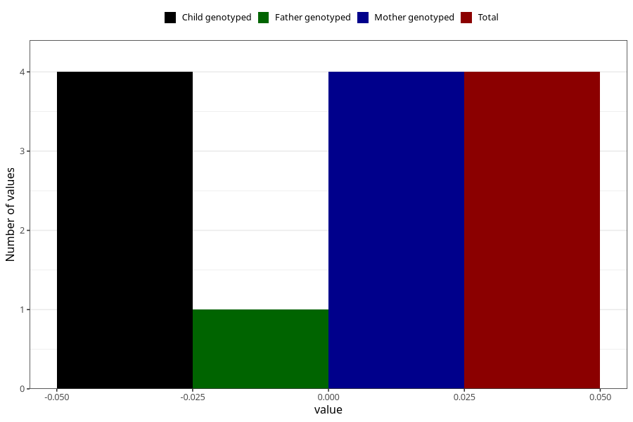

# high_blood_pressure_during_pregnancy_30w_2
Variable mapping to `CC1434` in `Skjema3_v12`.
- Number of values:

| Value | Total | Child genotyped | Mother genotyped | Father genotyped |
| ----- | ----- | --------------- | ---------------- | ---------------- |
| Missing | 77411 | 77411 | 72736 | 52157 |
| Non-missing | 3612 | 3612 | 3493 | 1154 |
| Do not know | 47 | 47 | 46 |12 |
| No | 3410 | 3410 | 3298 |1096 |
| Yes | 151 | 151 | 145 |45 |
| 0 | 4 | 4 | 4 | 1 |

