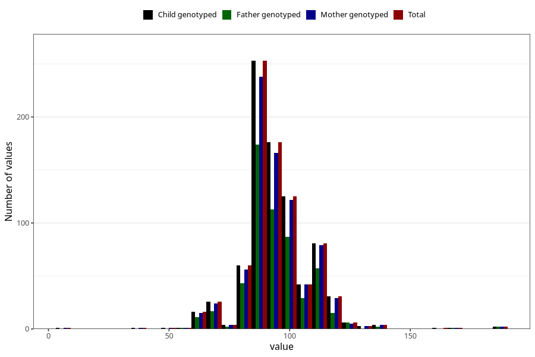

# highest_blood_pressure_before_pregnancy_diastolic
Variable mapping to `CC119` in `Skjema3_v12`.
- Number of values:

| Value | Total | Child genotyped | Mother genotyped | Father genotyped |
| ----- | ----- | --------------- | ---------------- | ---------------- |
| Missing | 80188 | 80188 | 75435 | 52751 |
| Non-missing | 835 | 835 | 794 | 560 |
| 25th percentile | 90 | 90 | 90 | 90 |
| 50th percentile | 95 | 95 | 95 | 95 |
| 75th percentile | 100 | 100 | 100 | 100 |
| Mean | 95.0107784431138 | 95.0107784431138 | 95.0541561712846 | 94.9196428571429 |
| Standard deviation | 13.9871002146579 | 13.9871002146579 | 13.8650799846912 | 13.5005057831823 |
| N | 835 | 835 | 794 | 560 |

