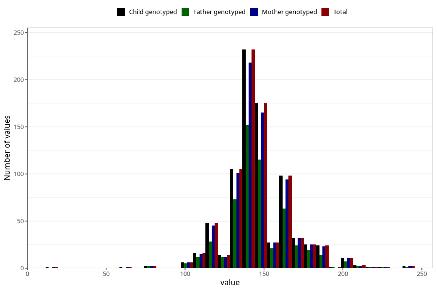

# highest_blood_pressure_before_pregnancy_systolic
Variable mapping to `CC118` in `Skjema3_v12`.
- Number of values:

| Value | Total | Child genotyped | Mother genotyped | Father genotyped |
| ----- | ----- | --------------- | ---------------- | ---------------- |
| Missing | 80198 | 80198 | 75445 | 52758 |
| Non-missing | 825 | 825 | 784 | 553 |
| 25th percentile | 140 | 140 | 140 | 140 |
| 50th percentile | 140 | 140 | 140 | 140 |
| 75th percentile | 155 | 155 | 155 | 155 |
| Mean | 146.173333333333 | 146.173333333333 | 146.285714285714 | 146.390596745027 |
| Standard deviation | 20.0353514429711 | 20.0353514429711 | 20.081824954087 | 19.5760145637773 |
| N | 825 | 825 | 784 | 553 |

