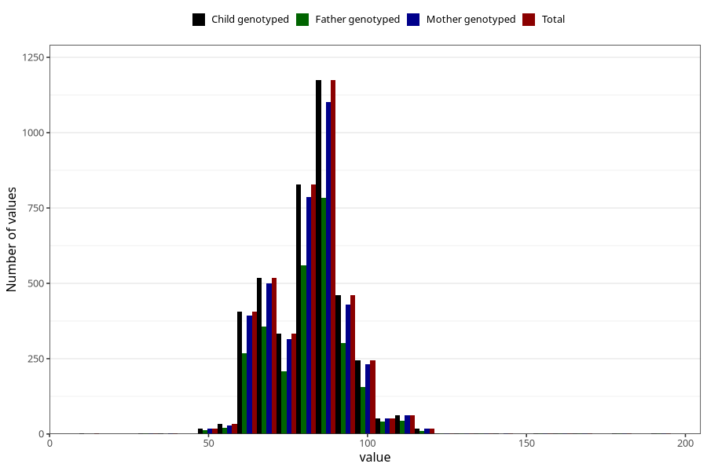

# highest_blood_pressure_during_pregnancy_30w_diastolic
Variable mapping to `CC115` in `Skjema3_v12`.
- Number of values:

| Value | Total | Child genotyped | Mother genotyped | Father genotyped |
| ----- | ----- | --------------- | ---------------- | ---------------- |
| Missing | 76854 | 76854 | 72279 | 50536 |
| Non-missing | 4169 | 4169 | 3950 | 2775 |
| 25th percentile | 74 | 74 | 74 | 74 |
| 50th percentile | 82 | 82 | 82 | 82 |
| 75th percentile | 90 | 90 | 90 | 90 |
| Mean | 82.3266970496522 | 82.3266970496522 | 82.3141772151899 | 82.3787387387387 |
| Standard deviation | 12.9418550429444 | 12.9418550429444 | 12.9773465486163 | 12.9579340701405 |
| N | 4169 | 4169 | 3950 | 2775 |

