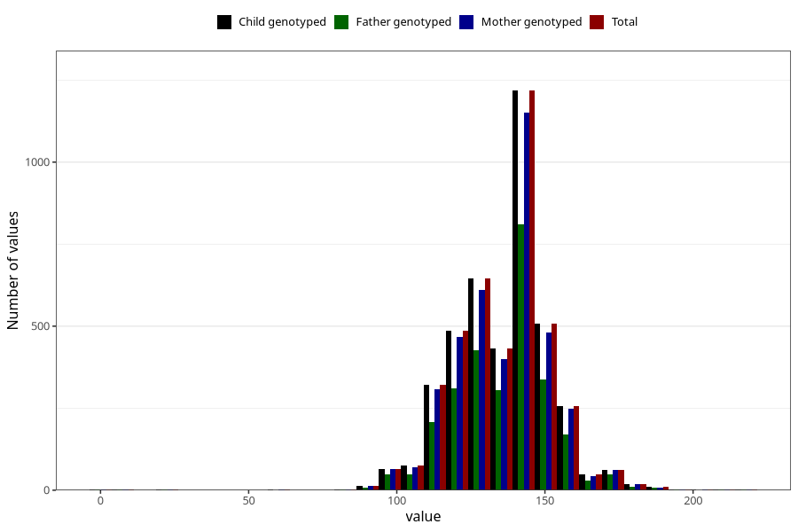

# highest_blood_pressure_during_pregnancy_30w_systolic
Variable mapping to `CC114` in `Skjema3_v12`.
- Number of values:

| Value | Total | Child genotyped | Mother genotyped | Father genotyped |
| ----- | ----- | --------------- | ---------------- | ---------------- |
| Missing | 76848 | 76848 | 72274 | 50531 |
| Non-missing | 4175 | 4175 | 3955 | 2780 |
| 25th percentile | 125 | 125 | 125 | 125 |
| 50th percentile | 140 | 140 | 140 | 140 |
| 75th percentile | 145 | 145 | 145 | 145 |
| Mean | 135.777245508982 | 135.777245508982 | 135.717067003793 | 135.863309352518 |
| Standard deviation | 16.1876635128605 | 16.1876635128605 | 16.2376632909274 | 16.3130809294653 |
| N | 4175 | 4175 | 3955 | 2780 |

