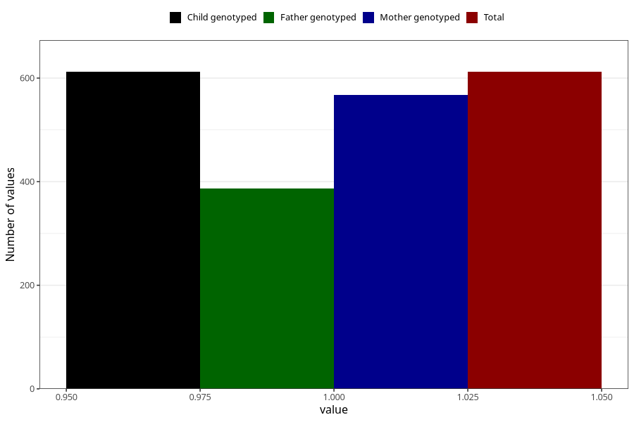

# hospitalized_bleeding
Variable mapping to `CC146` in `Skjema3_v12`.
- Number of values:

| Value | Total | Child genotyped | Mother genotyped | Father genotyped |
| ----- | ----- | --------------- | ---------------- | ---------------- |
| Missing | 80411 | 80411 | 75661 | 52924 |
| Non-missing | 612 | 612 | 568 | 387 |
| 1 | 612 | 612 | 568 | 387 |

