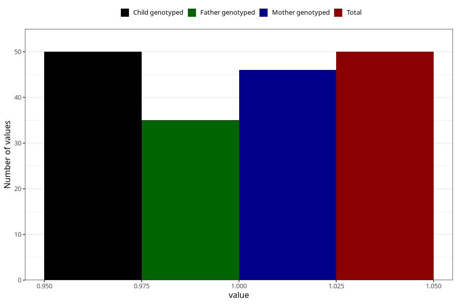

# hospitalized_bleeding_17_20w
Variable mapping to `CC151` in `Skjema3_v12`.
- Number of values:

| Value | Total | Child genotyped | Mother genotyped | Father genotyped |
| ----- | ----- | --------------- | ---------------- | ---------------- |
| Missing | 80973 | 80973 | 76183 | 53276 |
| Non-missing | 50 | 50 | 46 | 35 |
| 1 | 50 | 50 | 46 | 35 |

