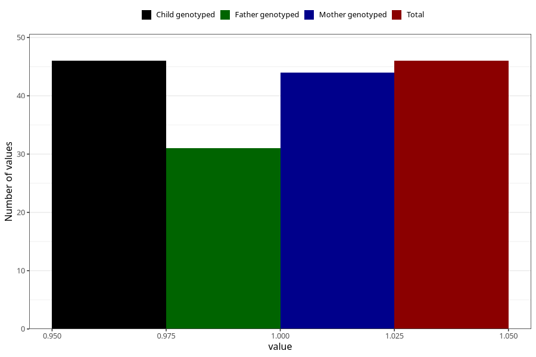

# hospitalized_bleeding_5_8w
Variable mapping to `CC148` in `Skjema3_v12`.
- Number of values:

| Value | Total | Child genotyped | Mother genotyped | Father genotyped |
| ----- | ----- | --------------- | ---------------- | ---------------- |
| Missing | 80977 | 80977 | 76185 | 53280 |
| Non-missing | 46 | 46 | 44 | 31 |
| 1 | 46 | 46 | 44 | 31 |

