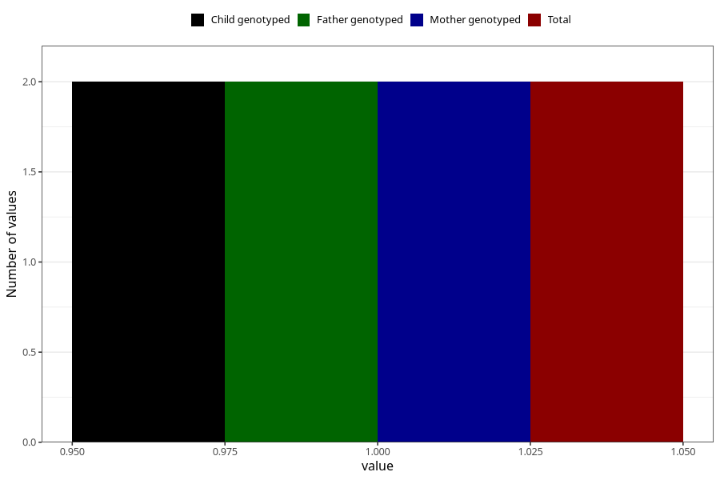

# hospitalized_high_blood_pressure_0_4w
Variable mapping to `CC174` in `Skjema3_v12`.
- Number of values:

| Value | Total | Child genotyped | Mother genotyped | Father genotyped |
| ----- | ----- | --------------- | ---------------- | ---------------- |
| Missing | 81021 | 81021 | 76227 | 53309 |
| Non-missing | 2 | 2 | 2 | 2 |
| 1 | 2 | 2 | 2 | 2 |

