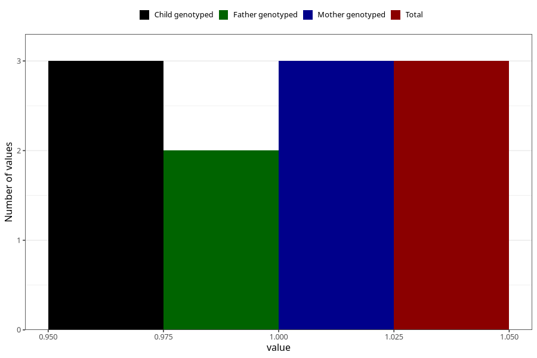

# hospitalized_high_blood_pressure_13_16w
Variable mapping to `CC177` in `Skjema3_v12`.
- Number of values:

| Value | Total | Child genotyped | Mother genotyped | Father genotyped |
| ----- | ----- | --------------- | ---------------- | ---------------- |
| Missing | 81020 | 81020 | 76226 | 53309 |
| Non-missing | 3 | 3 | 3 | 2 |
| 1 | 3 | 3 | 3 | 2 |

