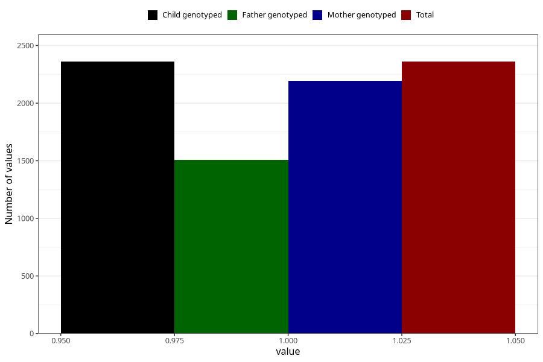

# hospitalized_other
Variable mapping to `CC191` in `Skjema3_v12`.
- Number of values:

| Value | Total | Child genotyped | Mother genotyped | Father genotyped |
| ----- | ----- | --------------- | ---------------- | ---------------- |
| Missing | 78663 | 78663 | 74033 | 51806 |
| Non-missing | 2360 | 2360 | 2196 | 1505 |
| 1 | 2360 | 2360 | 2196 | 1505 |

