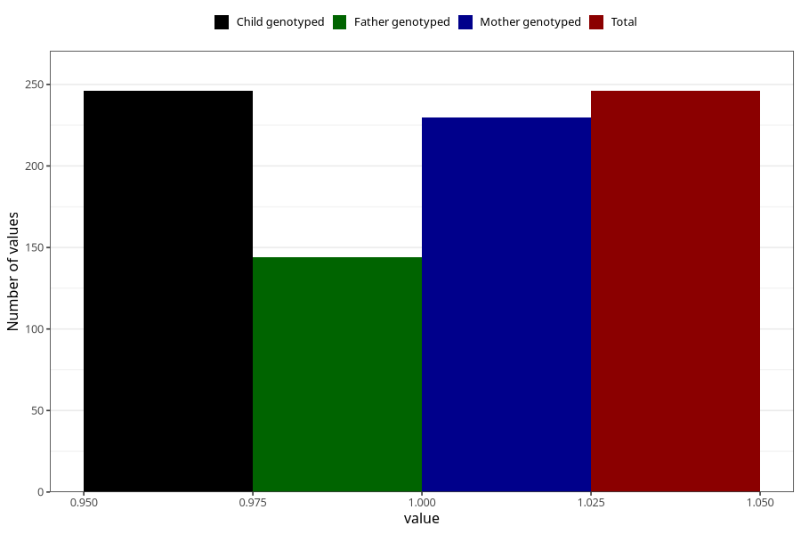

# hospitalized_other_13_16w
Variable mapping to `CC195` in `Skjema3_v12`.
- Number of values:

| Value | Total | Child genotyped | Mother genotyped | Father genotyped |
| ----- | ----- | --------------- | ---------------- | ---------------- |
| Missing | 80777 | 80777 | 75999 | 53167 |
| Non-missing | 246 | 246 | 230 | 144 |
| 1 | 246 | 246 | 230 | 144 |

