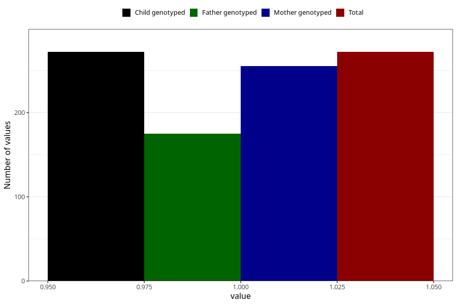

# hospitalized_other_17_20w
Variable mapping to `CC196` in `Skjema3_v12`.
- Number of values:

| Value | Total | Child genotyped | Mother genotyped | Father genotyped |
| ----- | ----- | --------------- | ---------------- | ---------------- |
| Missing | 80751 | 80751 | 75974 | 53136 |
| Non-missing | 272 | 272 | 255 | 175 |
| 1 | 272 | 272 | 255 | 175 |

