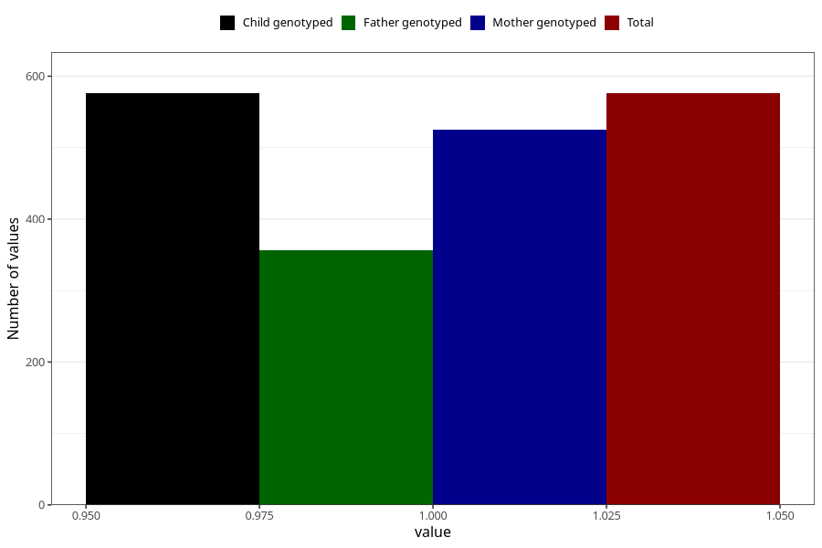

# hospitalized_other_25_28w
Variable mapping to `CC198` in `Skjema3_v12`.
- Number of values:

| Value | Total | Child genotyped | Mother genotyped | Father genotyped |
| ----- | ----- | --------------- | ---------------- | ---------------- |
| Missing | 80447 | 80447 | 75704 | 52954 |
| Non-missing | 576 | 576 | 525 | 357 |
| 1 | 576 | 576 | 525 | 357 |

