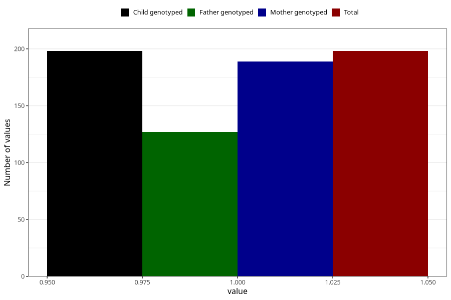

# hospitalized_other_5_8w
Variable mapping to `CC193` in `Skjema3_v12`.
- Number of values:

| Value | Total | Child genotyped | Mother genotyped | Father genotyped |
| ----- | ----- | --------------- | ---------------- | ---------------- |
| Missing | 80825 | 80825 | 76040 | 53184 |
| Non-missing | 198 | 198 | 189 | 127 |
| 1 | 198 | 198 | 189 | 127 |

