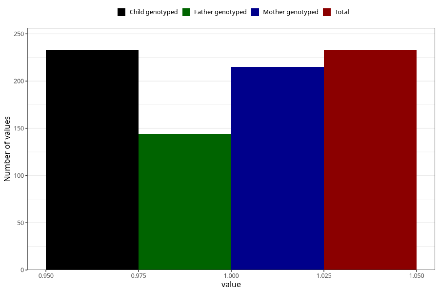

# hospitalized_other_9_12w
Variable mapping to `CC194` in `Skjema3_v12`.
- Number of values:

| Value | Total | Child genotyped | Mother genotyped | Father genotyped |
| ----- | ----- | --------------- | ---------------- | ---------------- |
| Missing | 80790 | 80790 | 76014 | 53167 |
| Non-missing | 233 | 233 | 215 | 144 |
| 1 | 233 | 233 | 215 | 144 |

