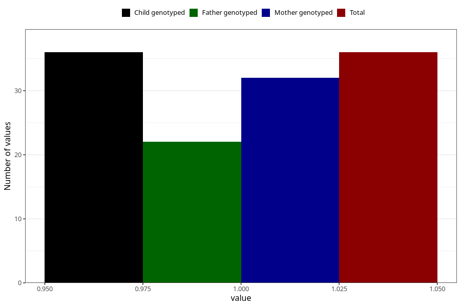

# hospitalized_prolonged_nausea_vomiting_25_28w
Variable mapping to `CC144` in `Skjema3_v12`.
- Number of values:

| Value | Total | Child genotyped | Mother genotyped | Father genotyped |
| ----- | ----- | --------------- | ---------------- | ---------------- |
| Missing | 80987 | 80987 | 76197 | 53289 |
| Non-missing | 36 | 36 | 32 | 22 |
| 1 | 36 | 36 | 32 | 22 |

