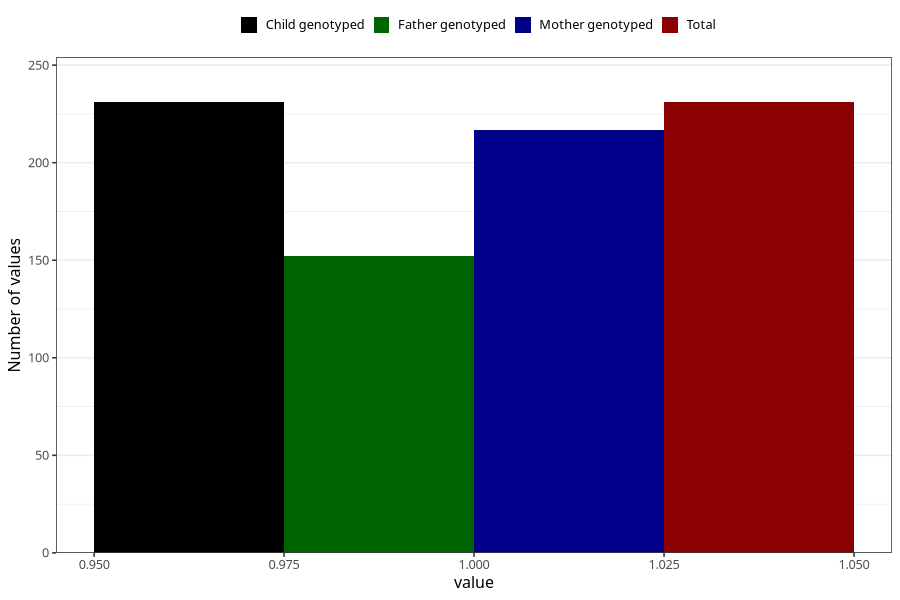

# hospitalized_threatening_preterm_labour_after_29w
Variable mapping to `CC172` in `Skjema3_v12`.
- Number of values:

| Value | Total | Child genotyped | Mother genotyped | Father genotyped |
| ----- | ----- | --------------- | ---------------- | ---------------- |
| Missing | 80792 | 80792 | 76012 | 53159 |
| Non-missing | 231 | 231 | 217 | 152 |
| 1 | 231 | 231 | 217 | 152 |

