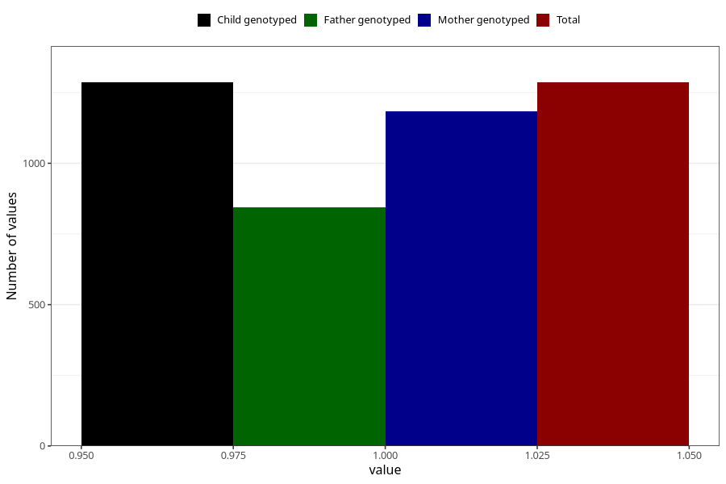

# influenza_9w_12w
Variable mapping to `AA378` in `Skjema1_v12`.
- Number of values:

| Value | Total | Child genotyped | Mother genotyped | Father genotyped |
| ----- | ----- | --------------- | ---------------- | ---------------- |
| Missing | 79737 | 79737 | 75045 | 52467 |
| Non-missing | 1286 | 1286 | 1184 | 844 |
| 1 | 1286 | 1286 | 1184 | 844 |

