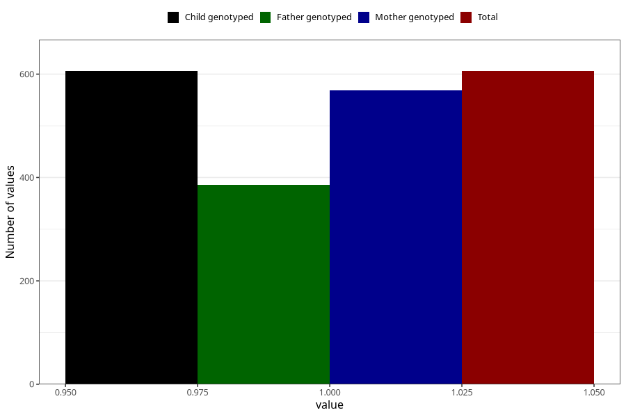

# influenza_before_4w
Variable mapping to `AA376` in `Skjema1_v12`.
- Number of values:

| Value | Total | Child genotyped | Mother genotyped | Father genotyped |
| ----- | ----- | --------------- | ---------------- | ---------------- |
| Missing | 80417 | 80417 | 75661 | 52925 |
| Non-missing | 606 | 606 | 568 | 386 |
| 1 | 606 | 606 | 568 | 386 |

