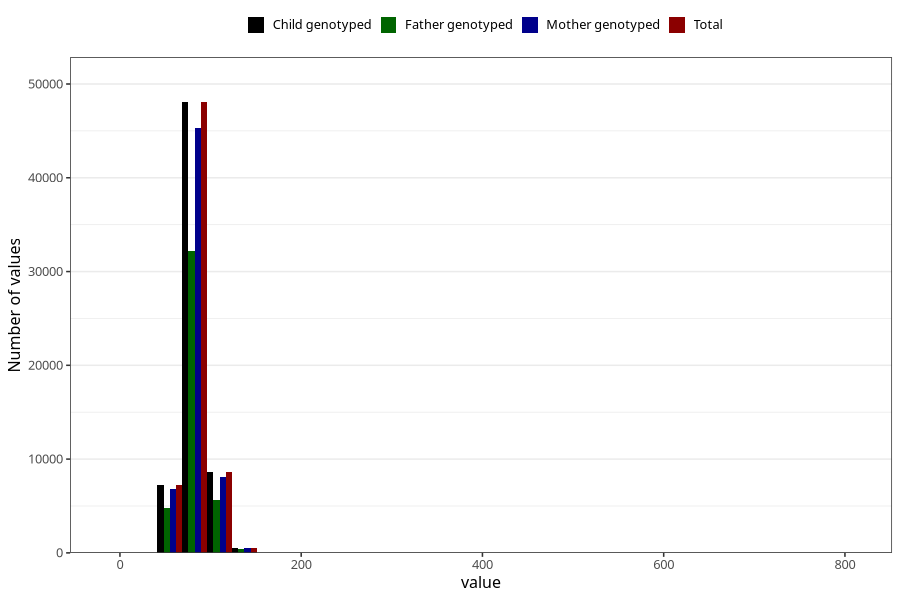

# mother_weight_end_self
Variable mapping to `DD672` in `Skjema4_6mnd_v12`.
- Number of values:

| Value | Total | Child genotyped | Mother genotyped | Father genotyped |
| ----- | ----- | --------------- | ---------------- | ---------------- |
| Missing | 16590 | 16590 | 15496 | 10283 |
| Non-missing | 64433 | 64433 | 60733 | 43028 |
| 25th percentile | 74 | 74 | 74 | 73.8 |
| 50th percentile | 81 | 81 | 81 | 81 |
| 75th percentile | 90 | 90 | 90 | 90 |
| Mean | 82.8652258935639 | 82.8652258935639 | 82.8256549157789 | 82.7930440643302 |
| Standard deviation | 14.0480560164861 | 14.0480560164861 | 14.0554328968832 | 13.9387224003062 |
| N | 64433 | 64433 | 60733 | 43028 |

