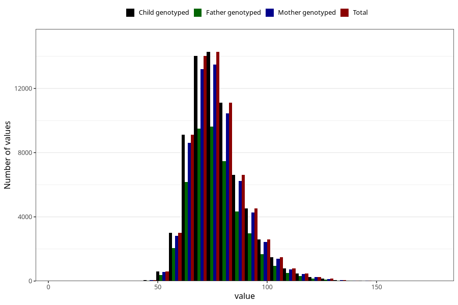

# mother_weight_last_check_30w
Variable mapping to `CC131` in `Skjema3_v12`.
- Number of values:

| Value | Total | Child genotyped | Mother genotyped | Father genotyped |
| ----- | ----- | --------------- | ---------------- | ---------------- |
| Missing | 11863 | 11863 | 11048 | 6968 |
| Non-missing | 69160 | 69160 | 65181 | 46343 |
| 25th percentile | 68.7 | 68.7 | 68.7 | 68.6 |
| 50th percentile | 75.5 | 75.5 | 75.5 | 75.3 |
| 75th percentile | 84 | 84 | 84 | 84 |
| Mean | 77.3802096587623 | 77.3802096587623 | 77.3532041545849 | 77.2226657747664 |
| Standard deviation | 12.5488529431572 | 12.5488529431572 | 12.5155328857309 | 12.4588123917115 |
| N | 69160 | 69160 | 65181 | 46343 |

