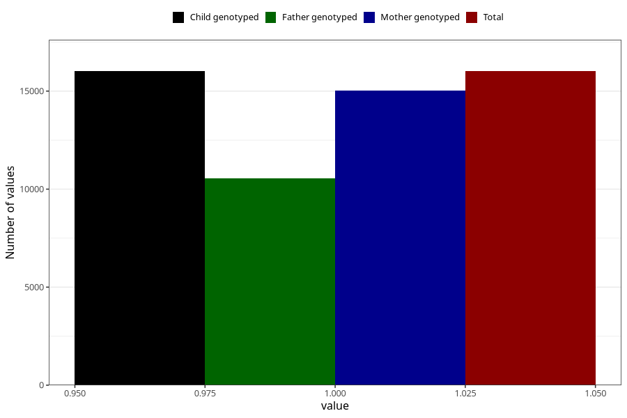

# nausea_before_4w
Variable mapping to `AA216` in `Skjema1_v12`.
- Number of values:

| Value | Total | Child genotyped | Mother genotyped | Father genotyped |
| ----- | ----- | --------------- | ---------------- | ---------------- |
| Missing | 65007 | 65007 | 61192 | 42756 |
| Non-missing | 16016 | 16016 | 15037 | 10555 |
| 1 | 16016 | 16016 | 15037 | 10555 |

