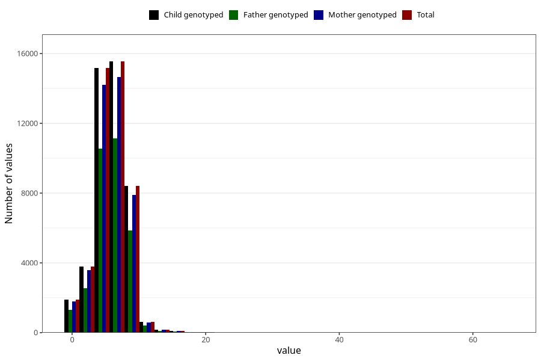

# nausea_week_most_bothered_from_q2
Variable mapping to `BB853` in `Skjema2CDW_v12`.
- Number of values:

| Value | Total | Child genotyped | Mother genotyped | Father genotyped |
| ----- | ----- | --------------- | ---------------- | ---------------- |
| Missing | 35215 | 35215 | 33229 | 21261 |
| Non-missing | 45808 | 45808 | 43000 | 32050 |
| 25th percentile | 4 | 4 | 4 | 4 |
| 50th percentile | 6 | 6 | 6 | 6 |
| 75th percentile | 7 | 7 | 7 | 7 |
| Mean | 5.73096402375131 | 5.73096402375131 | 5.72872093023256 | 5.74589703588143 |
| Standard deviation | 2.3895443243511 | 2.3895443243511 | 2.38729305115148 | 2.36284400209185 |
| N | 45808 | 45808 | 43000 | 32050 |

