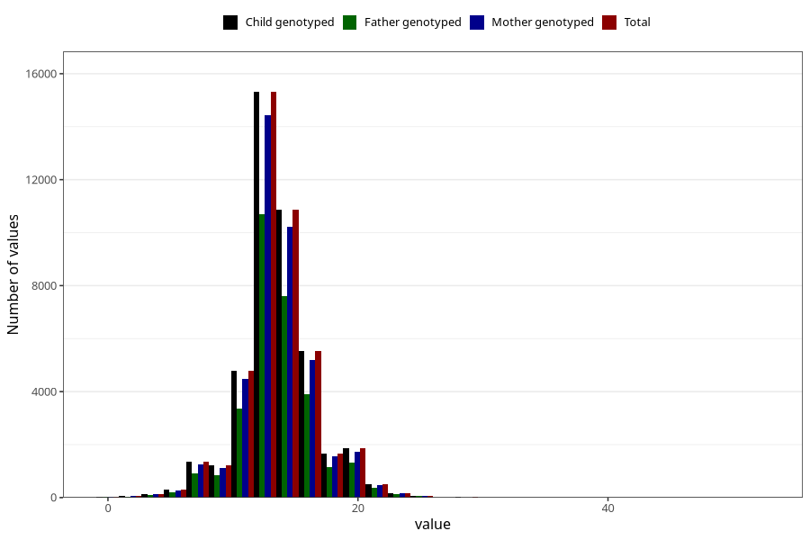

# nausea_week_most_bothered_to_q2
Variable mapping to `BB854` in `Skjema2CDW_v12`.
- Number of values:

| Value | Total | Child genotyped | Mother genotyped | Father genotyped |
| ----- | ----- | --------------- | ---------------- | ---------------- |
| Missing | 37112 | 37112 | 34996 | 22570 |
| Non-missing | 43911 | 43911 | 41233 | 30741 |
| 25th percentile | 12 | 12 | 12 | 12 |
| 50th percentile | 13 | 13 | 13 | 13 |
| 75th percentile | 15 | 15 | 15 | 15 |
| Mean | 13.5308464849354 | 13.5308464849354 | 13.5275386219775 | 13.5546013467356 |
| Standard deviation | 3.108168975496 | 3.108168975496 | 3.10119466030099 | 3.08677158276213 |
| N | 43911 | 43911 | 41233 | 30741 |

