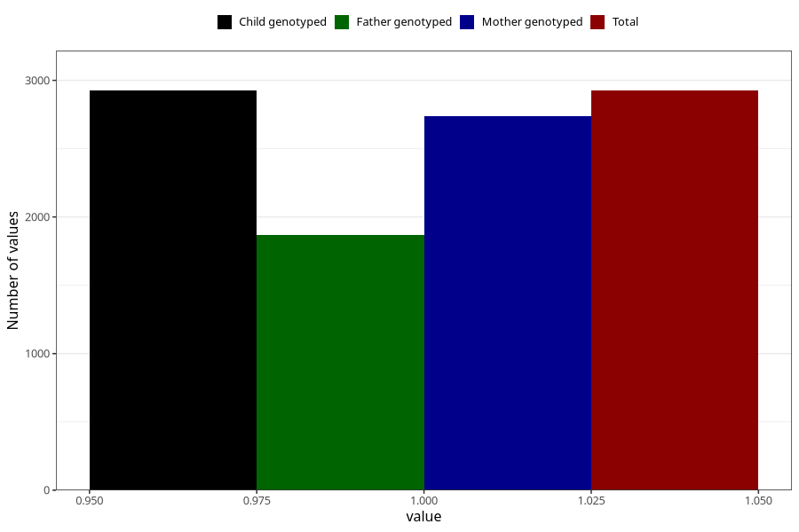

# oedema_13w_15w
Variable mapping to `AA319` in `Skjema1_v12`.
- Number of values:

| Value | Total | Child genotyped | Mother genotyped | Father genotyped |
| ----- | ----- | --------------- | ---------------- | ---------------- |
| Missing | 78098 | 78098 | 73489 | 51445 |
| Non-missing | 2925 | 2925 | 2740 | 1866 |
| 1 | 2925 | 2925 | 2740 | 1866 |

