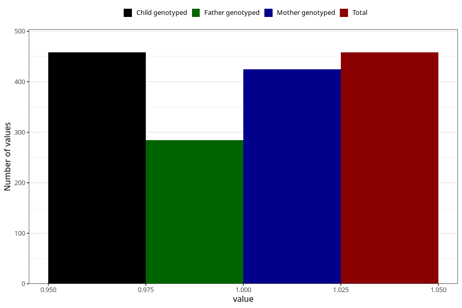

# oedema_5w_8w
Variable mapping to `AA317` in `Skjema1_v12`.
- Number of values:

| Value | Total | Child genotyped | Mother genotyped | Father genotyped |
| ----- | ----- | --------------- | ---------------- | ---------------- |
| Missing | 80565 | 80565 | 75804 | 53027 |
| Non-missing | 458 | 458 | 425 | 284 |
| 1 | 458 | 458 | 425 | 284 |

